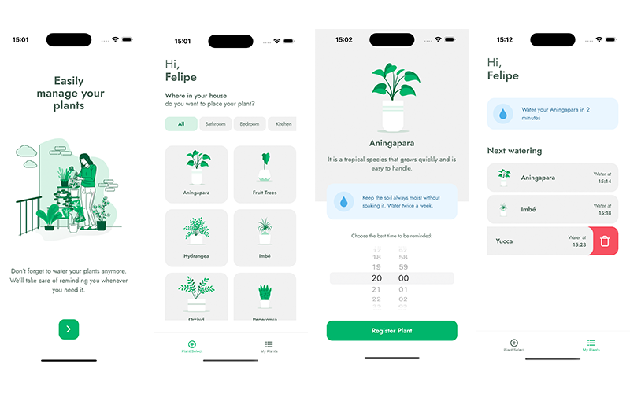

# Plant Manager

A mobile React Native app that tracks and schedules watering for plants with reminders and customized settings.

- Front End built with React Native, Expo and Typescript
- API Routes with JSON Server

To run locally clone the repo

```
$ npm install
$ npm start
$ npm run server
```

To run Android Simulator, change from localhost to your IP on api.ts.

